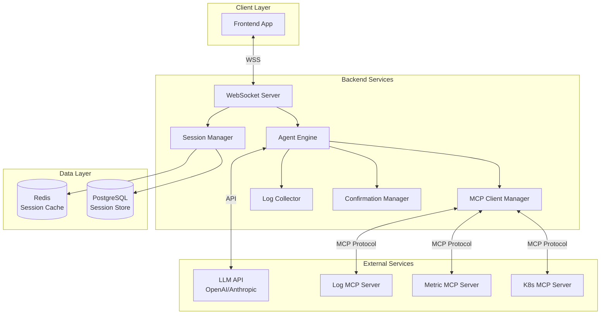

# Design Document

## Overview

OpsGenius Backend 是一个高性能的 Go 语言后端服务，采用微服务架构设计。系统通过 Gorilla WebSocket 提供实时通信能力，集成 LangChain Go SDK 实现智能 Agent 功能，通过 MCP 协议连接各种运维工具，并使用 PostgreSQL 持久化会话数据。

核心设计理念：
- **高并发**：利用 Go 的 goroutine 实现高并发处理
- **实时性**：WebSocket 双向通信，流式响应
- **可扩展**：模块化设计，支持水平扩展
- **可靠性**：完善的错误处理和重试机制
- **安全性**：加密通信，权限验证，敏感数据脱敏

## Architecture

### 系统架构图



### 技术栈选择

- **语言**: Go 1.21+
- **WebSocket**: gorilla/websocket
- **LLM 集成**: langchaingo (LangChain Go SDK)
- **MCP 客户端**: 自定义实现（基于 JSON-RPC 2.0）
- **数据库**: PostgreSQL 15+ (会话持久化)
- **缓存**: Redis 7+ (会话缓存、分布式锁)
- **配置**: viper (支持 YAML/JSON/ENV)
- **日志**: zap (高性能结构化日志)
- **HTTP 路由**: gin (健康检查、指标暴露)
- **测试**: testify + gopter (属性测试)


## Components and Interfaces

### 核心组件结构

```
cmd/
└── server/
    └── main.go                 # 应用入口

internal/
├── websocket/
│   ├── server.go              # WebSocket 服务器
│   ├── connection.go          # 连接管理
│   └── handler.go             # 消息处理器
├── agent/
│   ├── engine.go              # Agent 引擎
│   ├── intent.go              # 意图解析
│   ├── orchestrator.go        # 任务编排
│   └── stream.go              # 流式响应
├── mcp/
│   ├── client.go              # MCP 客户端
│   ├── manager.go             # MCP 连接管理
│   ├── tool.go                # 工具调用
│   └── protocol.go            # MCP 协议实现
├── session/
│   ├── manager.go             # 会话管理
│   ├── store.go               # 会话存储
│   └── cache.go               # 会话缓存
├── confirmation/
│   ├── manager.go             # 确认管理
│   └── request.go             # 确认请求
├── logger/
│   ├── collector.go           # 日志收集
│   └── reporter.go            # 日志上报
└── config/
    └── config.go              # 配置管理

pkg/
├── models/
│   ├── message.go             # 消息模型
│   ├── session.go             # 会话模型
│   ├── log.go                 # 日志模型
│   └── mcp.go                 # MCP 模型
└── utils/
    ├── crypto.go              # 加密工具
    └── retry.go               # 重试工具
```

### 核心接口定义

#### 1. WebSocket Server

```go
package websocket

type Server interface {
    Start(addr string) error
    Stop() error
    Broadcast(message []byte) error
    SendToConnection(connID string, message []byte) error
}

type Connection interface {
    ID() string
    Send(message []byte) error
    Close() error
    ReadMessage() ([]byte, error)
}

type MessageHandler interface {
    HandleMessage(conn Connection, message []byte) error
}
```

#### 2. Agent Engine

```go
package agent

type Engine interface {
    ProcessMessage(ctx context.Context, sessionID string, message string) (<-chan Response, error)
    Stop() error
}

type IntentParser interface {
    Parse(ctx context.Context, message string, history []Message) (*Intent, error)
}

type Intent struct {
    Type     IntentType            // query, analyze, operate
    Entities map[string]interface{} // node, service, timeRange, etc.
    Missing  []string              // missing slots
}

type TaskOrchestrator interface {
    Execute(ctx context.Context, intent *Intent) (<-chan TaskResult, error)
}

type Response struct {
    Type    ResponseType // text, chart, log, error, done
    Content interface{}
}
```

#### 3. MCP Client

```go
package mcp

type Client interface {
    Connect(config ServerConfig) error
    Disconnect() error
    ListTools() ([]Tool, error)
    CallTool(ctx context.Context, toolName string, args map[string]interface{}) (*ToolResult, error)
    Status() ConnectionStatus
}

type Manager interface {
    AddServer(config ServerConfig) error
    RemoveServer(serverID string) error
    GetClient(serverID string) (Client, error)
    ListServers() []ServerInfo
    BroadcastStatus() error
}

type Tool struct {
    Name        string
    Description string
    InputSchema map[string]interface{}
    Readonly    bool
}

type ToolResult struct {
    Success bool
    Data    interface{}
    Error   string
}
```

#### 4. Session Manager

```go
package session

type Manager interface {
    Create(userID string) (*Session, error)
    Get(sessionID string) (*Session, error)
    Update(session *Session) error
    Delete(sessionID string) error
    ListByUser(userID string, limit int) ([]*Session, error)
}

type Session struct {
    ID        string
    UserID    string
    Messages  []Message
    CreatedAt time.Time
    UpdatedAt time.Time
    ExpiresAt time.Time
}

type Message struct {
    ID        string
    Role      string // user, agent
    Content   string
    Timestamp time.Time
}
```

#### 5. Confirmation Manager

```go
package confirmation

type Manager interface {
    CreateRequest(ctx context.Context, operation Operation) (*Request, error)
    WaitForResponse(ctx context.Context, requestID string) (*Response, error)
    Confirm(requestID string) error
    Cancel(requestID string) error
}

type Request struct {
    ID          string
    Operation   Operation
    Description string
    RiskLevel   RiskLevel
    Timeout     time.Duration
    CreatedAt   time.Time
}

type Operation struct {
    Type   string // restart, modify_config, delete
    Target string
    Params map[string]interface{}
}

type Response struct {
    RequestID string
    Action    Action // confirmed, cancelled, timeout
    Timestamp time.Time
}
```

#### 6. Log Collector

```go
package logger

type Collector interface {
    Log(entry LogEntry) error
    GetLogs(sessionID string, limit int) ([]LogEntry, error)
    Subscribe(sessionID string) (<-chan LogEntry, error)
}

type LogEntry struct {
    ID         string
    SessionID  string
    Timestamp  time.Time
    Level      LogLevel // info, warning, error
    Message    string
    AgentRefs  []AgentReference
    Metadata   map[string]interface{}
}

type AgentReference struct {
    ID          string
    DisplayName string
    Type        string
}
```


## Data Models

### WebSocket 消息协议

#### 客户端 → 服务端

```go
type ClientMessage struct {
    Type      string          `json:"type"`
    Payload   json.RawMessage `json:"payload"`
    Timestamp int64           `json:"timestamp"`
}

// type: "user_message"
type UserMessagePayload struct {
    SessionID string `json:"sessionId"`
    Content   string `json:"content"`
}

// type: "confirmation_response"
type ConfirmationResponsePayload struct {
    RequestID string `json:"requestId"`
    Action    string `json:"action"` // "confirm" | "cancel"
}

// type: "heartbeat"
type HeartbeatPayload struct{}
```

#### 服务端 → 客户端

```go
type ServerMessage struct {
    Type      string      `json:"type"`
    Payload   interface{} `json:"payload"`
    Timestamp int64       `json:"timestamp"`
}

// type: "agent_stream"
type AgentStreamPayload struct {
    SessionID string `json:"sessionId"`
    MessageID string `json:"messageId"`
    Content   string `json:"content"`
    Done      bool   `json:"done"`
}

// type: "agent_log"
type AgentLogPayload struct {
    Log LogEntry `json:"log"`
}

// type: "mcp_status"
type MCPStatusPayload struct {
    ServerID string `json:"serverId"`
    Status   string `json:"status"` // "online" | "offline" | "error"
}

// type: "confirmation_request"
type ConfirmationRequestPayload struct {
    Request ConfirmationRequest `json:"request"`
}

// type: "chart_data"
type ChartDataPayload struct {
    SessionID string    `json:"sessionId"`
    MessageID string    `json:"messageId"`
    ChartType string    `json:"chartType"` // "line" | "bar" | "pie"
    Data      ChartData `json:"data"`
}

type ChartData struct {
    Labels  []string                 `json:"labels"`
    Datasets []ChartDataset          `json:"datasets"`
}

type ChartDataset struct {
    Label string    `json:"label"`
    Data  []float64 `json:"data"`
}
```

### MCP 协议消息

```go
// JSON-RPC 2.0 Request
type MCPRequest struct {
    JSONRPC string      `json:"jsonrpc"`
    ID      string      `json:"id"`
    Method  string      `json:"method"`
    Params  interface{} `json:"params"`
}

// JSON-RPC 2.0 Response
type MCPResponse struct {
    JSONRPC string      `json:"jsonrpc"`
    ID      string      `json:"id"`
    Result  interface{} `json:"result,omitempty"`
    Error   *MCPError   `json:"error,omitempty"`
}

type MCPError struct {
    Code    int    `json:"code"`
    Message string `json:"message"`
    Data    interface{} `json:"data,omitempty"`
}

// List Tools Request
type ListToolsParams struct{}

type ListToolsResult struct {
    Tools []MCPTool `json:"tools"`
}

type MCPTool struct {
    Name        string                 `json:"name"`
    Description string                 `json:"description"`
    InputSchema map[string]interface{} `json:"inputSchema"`
}

// Call Tool Request
type CallToolParams struct {
    Name      string                 `json:"name"`
    Arguments map[string]interface{} `json:"arguments"`
}

type CallToolResult struct {
    Content []ContentBlock `json:"content"`
}

type ContentBlock struct {
    Type string `json:"type"` // "text" | "image" | "resource"
    Text string `json:"text,omitempty"`
}
```

### 数据库模型

```go
// PostgreSQL Schema

type SessionRecord struct {
    ID        string    `db:"id"`
    UserID    string    `db:"user_id"`
    Title     string    `db:"title"`
    CreatedAt time.Time `db:"created_at"`
    UpdatedAt time.Time `db:"updated_at"`
    ExpiresAt time.Time `db:"expires_at"`
}

type MessageRecord struct {
    ID        string    `db:"id"`
    SessionID string    `db:"session_id"`
    Role      string    `db:"role"`
    Content   string    `db:"content"`
    Timestamp time.Time `db:"timestamp"`
}

type LogRecord struct {
    ID        string    `db:"id"`
    SessionID string    `db:"session_id"`
    Timestamp time.Time `db:"timestamp"`
    Level     string    `db:"level"`
    Message   string    `db:"message"`
    AgentRefs string    `db:"agent_refs"` // JSON
    Metadata  string    `db:"metadata"`   // JSON
}
```

### 配置文件模型

```yaml
# config.yaml

server:
  host: "0.0.0.0"
  port: 8080
  websocket_path: "/ws"
  tls:
    enabled: true
    cert_file: "/path/to/cert.pem"
    key_file: "/path/to/key.pem"

llm:
  provider: "openai"  # openai, anthropic, azure
  api_key: "${LLM_API_KEY}"
  model: "gpt-4"
  temperature: 0.7
  max_tokens: 2000

mcp_servers:
  - id: "log-mcp"
    name: "Log MCP Server"
    transport: "stdio"
    command: "python"
    args: ["-m", "log_mcp_server"]
    env:
      LOG_PATH: "/var/log"
  
  - id: "metric-mcp"
    name: "Metric MCP Server"
    transport: "http"
    url: "http://localhost:9090/mcp"
    auth:
      type: "bearer"
      token: "${METRIC_MCP_TOKEN}"
  
  - id: "k8s-mcp"
    name: "Kubernetes MCP Server"
    transport: "stdio"
    command: "k8s-mcp-server"
    args: ["--kubeconfig", "/path/to/kubeconfig"]

database:
  host: "localhost"
  port: 5432
  database: "opsgenius"
  user: "postgres"
  password: "${DB_PASSWORD}"
  max_connections: 100

redis:
  host: "localhost"
  port: 6379
  password: "${REDIS_PASSWORD}"
  db: 0
  pool_size: 50

security:
  auth_enabled: true
  jwt_secret: "${JWT_SECRET}"
  allowed_origins: ["https://app.opsgenius.io"]

logging:
  level: "info"  # debug, info, warn, error
  format: "json"
  output: "stdout"
```


## Correctness Properties

*属性（Property）是关于系统行为的形式化陈述，应该在所有有效执行中保持为真。属性是人类可读规范和机器可验证正确性保证之间的桥梁。*

### Property 1: WebSocket 连接 ID 唯一性

*对于任何*数量的客户端连接，每个连接分配的 ID 应该是唯一的，不存在重复。

**Validates: Requirements 1.1**

### Property 2: 消息类型路由正确性

*对于任何*客户端消息，消息应该根据其类型被路由到对应的处理器。

**Validates: Requirements 1.2**

### Property 3: 消息序列化往返一致性

*对于任何*服务端消息对象，序列化后通过 WebSocket 发送，前端反序列化后应该得到等价的对象。

**Validates: Requirements 1.3**

### Property 4: 连接断开资源清理

*对于任何*活跃连接，断开后其占用的资源（内存、goroutine）应该被释放，且会话状态应该被持久化。

**Validates: Requirements 1.4**

### Property 5: 意图类型有效性

*对于任何*用户消息，Intent Parser 返回的意图类型应该是预定义枚举值之一（query/analyze/operate）。

**Validates: Requirements 2.1**

### Property 6: 实体提取完整性

*对于任何*包含实体的用户消息，Intent Parser 应该提取所有可识别的实体（节点名、服务名、时间范围等）。

**Validates: Requirements 2.2**

### Property 7: 缺失槽位识别

*对于任何*不完整的意图，Intent Parser 应该识别出所有缺失的必需槽位。

**Validates: Requirements 2.3**

### Property 8: 意图对象结构完整性

*对于任何*成功识别的意图，返回的意图对象应该包含类型、实体和缺失槽位字段。

**Validates: Requirements 2.4**

### Property 9: MCP Server 连接初始化

*对于任何*MCP Server 配置列表，系统启动时应该尝试连接所有配置的服务器。

**Validates: Requirements 3.1**

### Property 10: 工具列表获取

*对于任何*成功连接的 MCP Server，应该获取并缓存该服务器提供的工具列表。

**Validates: Requirements 3.2**

### Property 11: MCP 断开状态更新

*对于任何*MCP Server 断开事件，系统应该更新该服务器的状态为 offline 并通过 WebSocket 通知前端。

**Validates: Requirements 3.4**

### Property 12: 工具调用路由正确性

*对于任何*工具调用请求，应该被路由到提供该工具的 MCP Server。

**Validates: Requirements 3.5**

### Property 13: 工具调用请求格式正确性

*对于任何*工具调用，构造的 MCP 请求应该符合 JSON-RPC 2.0 规范，包含正确的 method 和 params。

**Validates: Requirements 4.1**

### Property 14: 工具调用结果返回

*对于任何*成功的工具调用，应该返回包含结果数据的 ToolResult 对象。

**Validates: Requirements 4.2**

### Property 15: 只读/写操作权限控制

*对于任何*工具调用，如果工具标记为只读，应该直接执行；如果标记为写操作，应该先请求人工确认。

**Validates: Requirements 4.5**

### Property 16: 任务分解非平凡性

*对于任何*复杂任务，Task Orchestrator 应该将其分解为至少 2 个子任务。

**Validates: Requirements 5.1**

### Property 17: 子任务执行顺序正确性

*对于任何*有依赖关系的子任务序列，执行顺序应该满足依赖约束（依赖的子任务先执行）。

**Validates: Requirements 5.2**

### Property 18: 子任务结果传递

*对于任何*子任务链，前一个子任务的输出应该作为下一个子任务的输入。

**Validates: Requirements 5.4**

### Property 19: 任务结果汇总完整性

*对于任何*完成的任务，最终响应应该包含所有子任务的结果。

**Validates: Requirements 5.5**

### Property 20: 流式响应片段发送

*对于任何*Agent 响应，应该以多个片段的形式流式发送，而不是等待完整响应生成后一次性发送。

**Validates: Requirements 6.1**

### Property 21: 工具结果嵌入

*对于任何*包含工具调用结果的响应，响应内容应该包含结构化的工具结果数据。

**Validates: Requirements 6.2**

### Property 22: 图表数据单独发送

*对于任何*包含图表的响应，应该发送单独的 chart_data 类型消息，而不是嵌入在文本响应中。

**Validates: Requirements 6.3**

### Property 23: 流式响应完成标记

*对于任何*完成的流式响应，最后一个消息片段应该包含 done=true 标记。

**Validates: Requirements 6.4**

### Property 24: 确认请求创建和发送

*对于任何*高风险操作，应该创建确认请求并通过 WebSocket 发送到前端。

**Validates: Requirements 7.1**

### Property 25: 确认响应处理正确性

*对于任何*确认请求，接收到确认后应该执行操作，接收到取消后应该终止操作。

**Validates: Requirements 7.3, 7.4**

### Property 26: 会话创建或恢复

*对于任何*新连接，如果提供了有效的 session ID，应该恢复已有会话；否则应该创建新会话。

**Validates: Requirements 8.1**

### Property 27: 消息追加到会话历史

*对于任何*用户消息或 Agent 响应，应该被追加到对应会话的历史记录中。

**Validates: Requirements 8.2, 8.3**

### Property 28: 会话数据持久化往返一致性

*对于任何*会话数据，保存到数据库后再加载，应该得到等价的会话对象（消息内容、时间戳等）。

**Validates: Requirements 8.5**

### Property 29: 日志条目创建和发送

*对于任何*Agent 活动（任务开始、工具调用、中间结果），应该创建对应的日志条目并通过 WebSocket 实时发送到前端。

**Validates: Requirements 9.1, 9.2, 9.3, 9.4**

### Property 30: Agent 引用标记

*对于任何*包含 Agent 引用的日志，日志对象应该包含 AgentRefs 字段，且字段非空。

**Validates: Requirements 9.5**

### Property 31: 配置文件解析正确性

*对于任何*有效的配置文件（YAML/JSON），应该被正确解析为配置对象，包含所有必需字段。

**Validates: Requirements 11.1**

### Property 32: LLM 客户端初始化

*对于任何*包含 LLM 配置的配置文件，应该成功初始化 LLM 客户端。

**Validates: Requirements 11.2**

### Property 33: MCP Server 批量连接

*对于任何*MCP Server 配置列表，应该尝试连接列表中的所有服务器。

**Validates: Requirements 11.3**

### Property 34: 安全策略应用

*对于任何*包含安全配置的配置文件，应该应用对应的安全策略（TLS、身份验证等）。

**Validates: Requirements 11.4**

### Property 35: 客户端身份验证

*对于任何*WebSocket 连接请求，应该验证客户端提供的凭证（Token/证书），只有有效凭证才允许连接。

**Validates: Requirements 12.1**

### Property 36: 加密连接使用

*对于任何*敏感数据传输，应该使用 WSS（WebSocket Secure）加密连接。

**Validates: Requirements 12.2**

### Property 37: LLM 上下文凭证保护

*对于任何*发送到 LLM 的上下文，不应该包含敏感凭证（密码、API Key、Token 等）。

**Validates: Requirements 12.3**

### Property 38: 日志敏感信息脱敏

*对于任何*包含敏感信息的日志，敏感字段应该被脱敏（如密码替换为 ***）。

**Validates: Requirements 12.4**

### Property 39: 写操作权限验证

*对于任何*写操作请求，应该验证用户具有执行该操作的权限。

**Validates: Requirements 12.5**

### Property 40: MCP 连接池复用

*对于任何*MCP Server 调用序列，应该复用已有连接而不是每次创建新连接。

**Validates: Requirements 13.3**

### Property 41: Goroutine 并发数限制

*对于任何*系统负载状态，活跃的 goroutine 数量不应该超过配置的最大并发数。

**Validates: Requirements 13.4**


## Error Handling

### LLM 调用失败

**场景**: LLM API 调用失败（网络错误、限流、超时等）

**处理策略**:
1. 实施指数退避重试：1s, 2s, 4s，最多 3 次
2. 记录详细错误日志（错误类型、请求参数、响应状态）
3. 如果所有重试失败，返回友好错误消息给用户
4. 降级策略：使用缓存的响应或简化的规则引擎

**实现**:
```go
func (e *Engine) callLLMWithRetry(ctx context.Context, prompt string) (string, error) {
    var lastErr error
    for attempt := 0; attempt < 3; attempt++ {
        resp, err := e.llmClient.Generate(ctx, prompt)
        if err == nil {
            return resp, nil
        }
        lastErr = err
        
        if !isRetryable(err) {
            break
        }
        
        backoff := time.Duration(math.Pow(2, float64(attempt))) * time.Second
        time.Sleep(backoff)
    }
    return "", fmt.Errorf("LLM call failed after 3 attempts: %w", lastErr)
}
```

### MCP Server 连接失败

**场景**: MCP Server 无法连接或连接断开

**处理策略**:
1. 记录连接失败日志
2. 更新服务器状态为 offline
3. 通过 WebSocket 通知前端状态变化
4. 定期重试连接（每 30 秒）
5. 如果有备用服务器，尝试使用备用服务器

**实现**:
```go
func (m *Manager) reconnectLoop(serverID string) {
    ticker := time.NewTicker(30 * time.Second)
    defer ticker.Stop()
    
    for range ticker.C {
        if m.clients[serverID].Status() == StatusOnline {
            return
        }
        
        if err := m.clients[serverID].Connect(m.configs[serverID]); err != nil {
            log.Warn("MCP reconnect failed", zap.String("server", serverID), zap.Error(err))
        } else {
            log.Info("MCP reconnected", zap.String("server", serverID))
            m.broadcastStatus(serverID, StatusOnline)
            return
        }
    }
}
```

### Panic 恢复

**场景**: Goroutine 中发生 panic

**处理策略**:
1. 使用 defer + recover 捕获 panic
2. 记录完整的堆栈信息
3. 发送错误消息到前端
4. 清理相关资源
5. 不影响其他 goroutine 的运行

**实现**:
```go
func (s *Server) handleConnection(conn *Connection) {
    defer func() {
        if r := recover(); r != nil {
            stack := debug.Stack()
            log.Error("Panic in connection handler",
                zap.Any("panic", r),
                zap.String("stack", string(stack)))
            
            conn.SendError("Internal server error")
            conn.Close()
        }
    }()
    
    // Connection handling logic
}
```

### 数据库操作失败

**场景**: PostgreSQL 连接失败或查询错误

**处理策略**:
1. 记录错误日志
2. 降级为 Redis 缓存
3. 如果 Redis 也不可用，降级为内存存储
4. 定期尝试恢复数据库连接
5. 在内存模式下提示用户数据不会持久化

**实现**:
```go
type SessionStore struct {
    db     *sql.DB
    redis  *redis.Client
    memory map[string]*Session
    mode   StorageMode
}

func (s *SessionStore) Save(session *Session) error {
    // Try PostgreSQL first
    if s.mode == ModePG {
        if err := s.saveToPostgres(session); err != nil {
            log.Warn("PostgreSQL save failed, falling back to Redis", zap.Error(err))
            s.mode = ModeRedis
        } else {
            return nil
        }
    }
    
    // Try Redis
    if s.mode == ModeRedis {
        if err := s.saveToRedis(session); err != nil {
            log.Warn("Redis save failed, falling back to memory", zap.Error(err))
            s.mode = ModeMemory
        } else {
            return nil
        }
    }
    
    // Fallback to memory
    s.memory[session.ID] = session
    return nil
}
```

### 资源耗尽

**场景**: 系统资源不足（内存、goroutine、连接数）

**处理策略**:
1. 监控资源使用情况
2. 达到阈值时拒绝新连接
3. 返回 503 Service Unavailable 错误
4. 提供友好的错误消息
5. 记录资源耗尽事件用于告警

**实现**:
```go
type ResourceLimiter struct {
    maxConnections int
    currentConns   atomic.Int32
    maxGoroutines  int
}

func (r *ResourceLimiter) AcquireConnection() error {
    current := r.currentConns.Load()
    if current >= int32(r.maxConnections) {
        return errors.New("connection limit reached")
    }
    
    r.currentConns.Add(1)
    return nil
}

func (r *ResourceLimiter) ReleaseConnection() {
    r.currentConns.Add(-1)
}
```

### WebSocket 消息解析失败

**场景**: 接收到格式错误的客户端消息

**处理策略**:
1. 记录错误日志（包含原始消息）
2. 发送错误响应给客户端
3. 不关闭连接（允许客户端重试）
4. 如果连续失败超过 10 次，关闭连接

**实现**:
```go
func (h *Handler) HandleMessage(conn Connection, data []byte) error {
    var msg ClientMessage
    if err := json.Unmarshal(data, &msg); err != nil {
        log.Warn("Failed to parse message",
            zap.String("conn", conn.ID()),
            zap.Error(err),
            zap.String("raw", string(data)))
        
        conn.SendError("Invalid message format")
        
        conn.IncrementErrorCount()
        if conn.ErrorCount() > 10 {
            log.Warn("Too many errors, closing connection", zap.String("conn", conn.ID()))
            return conn.Close()
        }
        
        return nil
    }
    
    // Process message
    return h.processMessage(conn, &msg)
}
```


## Testing Strategy

### 测试方法概述

OpsGenius Backend 采用**双重测试策略**：单元测试和属性测试相结合，确保全面的代码覆盖和正确性验证。

- **单元测试**: 验证特定示例、边界情况和错误条件
- **属性测试**: 验证通用属性在所有输入下都成立
- 两者互补，共同提供全面的测试覆盖

### 测试框架选择

- **测试框架**: Go 标准库 testing
- **断言库**: testify/assert, testify/require
- **Mock 工具**: testify/mock, gomock
- **属性测试库**: gopter (Go 的 QuickCheck 实现)
- **集成测试**: testcontainers-go (Docker 容器测试)

### 单元测试策略

单元测试专注于：
1. **具体示例**: 验证特定输入产生预期输出
2. **边界情况**: 空输入、超大数据、超时等
3. **错误条件**: 网络失败、数据格式错误、资源耗尽等
4. **集成点**: 组件间交互、外部服务调用等

**示例**:
```go
func TestWebSocketServer_AssignUniqueConnectionID(t *testing.T) {
    server := NewServer()
    
    conn1 := server.AcceptConnection(mockConn1)
    conn2 := server.AcceptConnection(mockConn2)
    
    assert.NotEqual(t, conn1.ID(), conn2.ID())
}

func TestIntentParser_ExtractEntities(t *testing.T) {
    parser := NewIntentParser(mockLLM)
    
    intent, err := parser.Parse(context.Background(), 
        "查询 Node-A 上最近 10 分钟的 Nginx 错误日志", nil)
    
    require.NoError(t, err)
    assert.Equal(t, IntentTypeQuery, intent.Type)
    assert.Equal(t, "Node-A", intent.Entities["node"])
    assert.Equal(t, "Nginx", intent.Entities["service"])
    assert.Equal(t, "10分钟", intent.Entities["timeRange"])
}

func TestMCPClient_HandleConnectionFailure(t *testing.T) {
    client := NewClient()
    
    err := client.Connect(ServerConfig{
        URL: "http://invalid-server:9999",
    })
    
    assert.Error(t, err)
    assert.Equal(t, StatusOffline, client.Status())
}
```

### 属性测试策略

属性测试验证通用规则在大量随机生成的输入下都成立。每个属性测试：
- 运行**至少 100 次迭代**（由于随机化）
- 使用注释标记对应的设计文档属性
- 标记格式: `// Feature: ops-genius-backend, Property N: [property text]`

**示例**:
```go
import (
    "github.com/leanovate/gopter"
    "github.com/leanovate/gopter/gen"
    "github.com/leanovate/gopter/prop"
)

// Feature: ops-genius-backend, Property 1: WebSocket 连接 ID 唯一性
func TestProperty_ConnectionIDUniqueness(t *testing.T) {
    properties := gopter.NewProperties(nil)
    
    properties.Property("all connection IDs should be unique", prop.ForAll(
        func(n int) bool {
            server := NewServer()
            ids := make(map[string]bool)
            
            for i := 0; i < n; i++ {
                conn := server.AcceptConnection(mockConnection())
                if ids[conn.ID()] {
                    return false // Duplicate ID found
                }
                ids[conn.ID()] = true
            }
            
            return true
        },
        gen.IntRange(1, 1000),
    ))
    
    properties.TestingRun(t, gopter.ConsoleReporter(false))
}

// Feature: ops-genius-backend, Property 3: 消息序列化往返一致性
func TestProperty_MessageSerializationRoundTrip(t *testing.T) {
    properties := gopter.NewProperties(nil)
    
    properties.Property("message should round-trip through serialization", prop.ForAll(
        func(msg ServerMessage) bool {
            // Serialize
            data, err := json.Marshal(msg)
            if err != nil {
                return false
            }
            
            // Deserialize
            var decoded ServerMessage
            if err := json.Unmarshal(data, &decoded); err != nil {
                return false
            }
            
            // Compare
            return reflect.DeepEqual(msg, decoded)
        },
        genServerMessage(),
    ))
    
    properties.TestingRun(t, gopter.ConsoleReporter(false))
}

// Feature: ops-genius-backend, Property 28: 会话数据持久化往返一致性
func TestProperty_SessionPersistenceRoundTrip(t *testing.T) {
    properties := gopter.NewProperties(nil)
    
    properties.Property("session should round-trip through database", prop.ForAll(
        func(session Session) bool {
            store := NewSessionStore(testDB)
            
            // Save
            if err := store.Save(&session); err != nil {
                return false
            }
            
            // Load
            loaded, err := store.Get(session.ID)
            if err != nil {
                return false
            }
            
            // Compare (ignoring timestamps)
            return sessionsEqual(&session, loaded)
        },
        genSession(),
    ))
    
    properties.TestingRun(t, gopter.ConsoleReporter(false))
}

// Custom generator for ServerMessage
func genServerMessage() gopter.Gen {
    return gen.OneGenOf(
        genAgentStreamPayload(),
        genAgentLogPayload(),
        genMCPStatusPayload(),
    ).Map(func(payload interface{}) ServerMessage {
        return ServerMessage{
            Type:      getMessageType(payload),
            Payload:   payload,
            Timestamp: time.Now().Unix(),
        }
    })
}

// Custom generator for Session
func genSession() gopter.Gen {
    return gopter.CombineGens(
        gen.Identifier(),
        gen.Identifier(),
        gen.SliceOf(genMessage()),
    ).Map(func(values []interface{}) Session {
        return Session{
            ID:       values[0].(string),
            UserID:   values[1].(string),
            Messages: values[2].([]Message),
            CreatedAt: time.Now(),
            UpdatedAt: time.Now(),
        }
    })
}
```

### 集成测试策略

集成测试验证组件间交互和外部服务集成：

**示例**:
```go
func TestIntegration_WebSocketToAgent(t *testing.T) {
    // Start test containers
    ctx := context.Background()
    pgContainer, _ := testcontainers.GenericContainer(ctx, testcontainers.GenericContainerRequest{
        ContainerRequest: testcontainers.ContainerRequest{
            Image: "postgres:15",
            Env: map[string]string{
                "POSTGRES_PASSWORD": "test",
            },
        },
        Started: true,
    })
    defer pgContainer.Terminate(ctx)
    
    // Start server
    server := NewServer(testConfig)
    go server.Start(":8080")
    defer server.Stop()
    
    // Connect WebSocket client
    ws, _, err := websocket.DefaultDialer.Dial("ws://localhost:8080/ws", nil)
    require.NoError(t, err)
    defer ws.Close()
    
    // Send user message
    msg := ClientMessage{
        Type: "user_message",
        Payload: UserMessagePayload{
            SessionID: "test-session",
            Content:   "查询系统状态",
        },
    }
    err = ws.WriteJSON(msg)
    require.NoError(t, err)
    
    // Receive agent response
    var resp ServerMessage
    err = ws.ReadJSON(&resp)
    require.NoError(t, err)
    assert.Equal(t, "agent_stream", resp.Type)
}
```

### 测试覆盖目标

- **语句覆盖**: > 80%
- **分支覆盖**: > 75%
- **函数覆盖**: > 85%
- **属性测试**: 每个正确性属性至少一个测试

### 测试组织结构

```
internal/
├── websocket/
│   ├── server.go
│   ├── server_test.go              # 单元测试
│   └── server_property_test.go     # 属性测试
├── agent/
│   ├── engine.go
│   ├── engine_test.go
│   └── engine_property_test.go
├── mcp/
│   ├── client.go
│   ├── client_test.go
│   └── client_property_test.go
└── integration/
    ├── websocket_agent_test.go     # 集成测试
    └── mcp_integration_test.go
```

### 持续集成

- 所有测试在 PR 合并前必须通过
- 属性测试失败时，保存反例用于回归测试
- 定期运行更长时间的属性测试（1000+ 迭代）
- 使用 GitHub Actions 自动运行测试
- 集成测试使用 testcontainers 确保环境一致性

### 性能测试

使用 Go 的 benchmark 工具测试关键路径性能：

```go
func BenchmarkAgentEngine_ProcessMessage(b *testing.B) {
    engine := NewEngine(testConfig)
    ctx := context.Background()
    
    b.ResetTimer()
    for i := 0; i < b.N; i++ {
        _, _ = engine.ProcessMessage(ctx, "test-session", "查询系统状态")
    }
}

func BenchmarkMCPClient_CallTool(b *testing.B) {
    client := NewClient()
    client.Connect(testServerConfig)
    ctx := context.Background()
    
    b.ResetTimer()
    for i := 0; i < b.N; i++ {
        _, _ = client.CallTool(ctx, "get_logs", map[string]interface{}{
            "node": "Node-A",
            "limit": 100,
        })
    }
}
```

