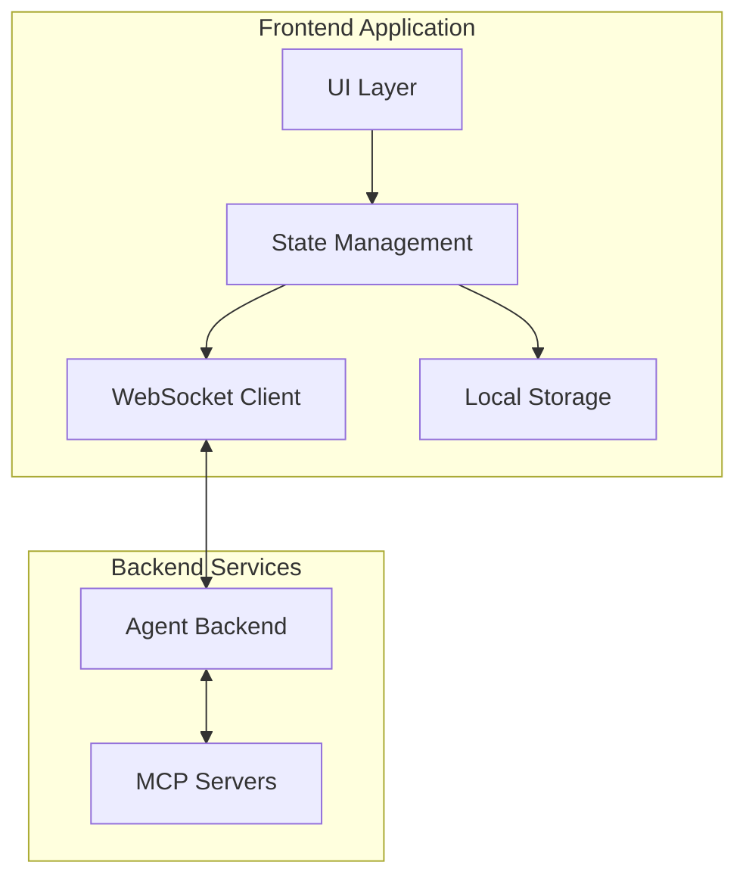

# Design Document

## Overview

OpsGenius Frontend 是一个现代化的智能运维平台前端应用，采用 React 18+ 和 TypeScript 构建。系统采用组件化架构，通过 WebSocket 与后端 Agent 系统实时通信，提供流畅的对话式交互体验。

核心设计理念：
- **实时性**：通过 WebSocket 实现双向实时通信
- **模块化**：清晰的组件边界和职责划分
- **可扩展性**：支持插件式图表组件和自定义 MCP Server
- **用户体验**：流式响应、平滑动画、响应式布局

## Architecture

### 系统架构图



### 技术栈选择

- **框架**: React 18.3+ (支持并发特性和 Suspense)
- **语言**: TypeScript 5.0+
- **状态管理**: Zustand (轻量级、简单易用)
- **样式方案**: Tailwind CSS + CSS Modules
- **图表库**: Recharts (声明式、React 友好)
- **Markdown 渲染**: react-markdown + remark-gfm
- **代码高亮**: Prism.js
- **WebSocket**: native WebSocket API
- **构建工具**: Vite


## Components and Interfaces

### 组件层次结构

```
App
├── Layout
│   ├── MCPStatusPanel (左侧边栏)
│   ├── MainContent (中间区域)
│   │   ├── ChatInterface
│   │   │   ├── MessageList
│   │   │   │   ├── UserMessage
│   │   │   │   ├── AgentMessage
│   │   │   │   │   ├── MarkdownRenderer
│   │   │   │   │   ├── CodeBlock
│   │   │   │   │   └── ChartRenderer
│   │   │   │   └── ConfirmationCard
│   │   │   └── MessageInput
│   │   └── SessionManager
│   └── LogViewer (右侧区域)
│       ├── LogList
│       └── LogEntry
└── ContextModal
```

### 核心组件接口

#### 1. ChatInterface

```typescript
interface ChatInterfaceProps {
  sessionId: string;
  onSendMessage: (message: string) => void;
}

interface Message {
  id: string;
  role: 'user' | 'agent';
  content: string;
  timestamp: number;
  streaming?: boolean;
  charts?: ChartData[];
}
```

#### 2. MCPStatusPanel

```typescript
interface MCPServer {
  id: string;
  name: string;
  status: 'online' | 'offline' | 'error';
  tools: MCPTool[];
  lastHeartbeat?: number;
}

interface MCPTool {
  name: string;
  description: string;
  readonly: boolean;
}

interface MCPStatusPanelProps {
  servers: MCPServer[];
  onServerClick: (serverId: string) => void;
}
```

#### 3. LogViewer

```typescript
interface LogEntry {
  id: string;
  timestamp: number;
  level: 'info' | 'warning' | 'error';
  message: string;
  agentRefs?: AgentReference[];
  metadata?: Record<string, unknown>;
}

interface AgentReference {
  id: string;
  displayName: string;
  type: string;
}

interface LogViewerProps {
  logs: LogEntry[];
  onAgentClick: (agent: AgentReference) => void;
  autoScroll?: boolean;
}
```

#### 4. ConfirmationCard

```typescript
interface ConfirmationRequest {
  id: string;
  operation: string;
  description: string;
  riskLevel: 'low' | 'medium' | 'high';
  timeout: number;
}

interface ConfirmationCardProps {
  request: ConfirmationRequest;
  onConfirm: (id: string) => void;
  onCancel: (id: string) => void;
}
```

#### 5. ContextModal

```typescript
interface ContextLog {
  id: string;
  timestamp: number;
  message: string;
  level: string;
}

interface ContextModalProps {
  visible: boolean;
  agentId: string;
  logs: ContextLog[];
  onClose: () => void;
}
```


## Data Models

### WebSocket 消息协议

#### 客户端 → 服务端

```typescript
// 用户消息
interface UserMessagePayload {
  type: 'user_message';
  sessionId: string;
  content: string;
  timestamp: number;
}

// 确认响应
interface ConfirmationResponsePayload {
  type: 'confirmation_response';
  requestId: string;
  action: 'confirm' | 'cancel';
  timestamp: number;
}

// 心跳
interface HeartbeatPayload {
  type: 'heartbeat';
  timestamp: number;
}

type ClientMessage = UserMessagePayload | ConfirmationResponsePayload | HeartbeatPayload;
```

#### 服务端 → 客户端

```typescript
// Agent 流式响应
interface AgentStreamPayload {
  type: 'agent_stream';
  sessionId: string;
  messageId: string;
  content: string;
  done: boolean;
  timestamp: number;
}

// Agent 日志
interface AgentLogPayload {
  type: 'agent_log';
  log: LogEntry;
}

// MCP 状态更新
interface MCPStatusPayload {
  type: 'mcp_status';
  serverId: string;
  status: 'online' | 'offline' | 'error';
  timestamp: number;
}

// 确认请求
interface ConfirmationRequestPayload {
  type: 'confirmation_request';
  request: ConfirmationRequest;
}

// 图表数据
interface ChartDataPayload {
  type: 'chart_data';
  sessionId: string;
  messageId: string;
  chartType: 'line' | 'bar' | 'pie';
  data: ChartData;
}

type ServerMessage = 
  | AgentStreamPayload 
  | AgentLogPayload 
  | MCPStatusPayload 
  | ConfirmationRequestPayload
  | ChartDataPayload;
```

### 状态管理模型

使用 Zustand 管理全局状态：

```typescript
interface AppState {
  // 会话状态
  currentSessionId: string;
  sessions: Map<string, Session>;
  
  // 消息状态
  messages: Map<string, Message[]>;
  streamingMessages: Map<string, string>;
  
  // MCP 状态
  mcpServers: MCPServer[];
  
  // 日志状态
  logs: LogEntry[];
  
  // 确认请求
  pendingConfirmations: ConfirmationRequest[];
  
  // WebSocket 状态
  wsConnected: boolean;
  wsError: string | null;
  
  // Actions
  sendMessage: (content: string) => void;
  createSession: () => string;
  loadSession: (sessionId: string) => void;
  updateMCPStatus: (serverId: string, status: string) => void;
  addLog: (log: LogEntry) => void;
  confirmOperation: (requestId: string) => void;
  cancelOperation: (requestId: string) => void;
}
```

### 本地存储模型

```typescript
interface StoredSession {
  id: string;
  title: string;
  createdAt: number;
  updatedAt: number;
  messages: Message[];
}

interface LocalStorageSchema {
  sessions: StoredSession[];
  currentSessionId: string;
  mcpConfig: MCPServerConfig[];
}
```


## Correctness Properties

*属性（Property）是关于系统行为的形式化陈述，应该在所有有效执行中保持为真。属性是人类可读规范和机器可验证正确性保证之间的桥梁。*

### Property 1: 消息提交完整性

*对于任何*非空消息内容，当用户提交消息时，该消息应该同时出现在对话区并被发送到后端。

**Validates: Requirements 1.1**

### Property 2: 流式响应实时性

*对于任何*流式数据块序列，每个数据块到达时都应该立即在界面上可见，而不是等待整个响应完成。

**Validates: Requirements 1.2**

### Property 3: Markdown 渲染正确性

*对于任何*包含 Markdown 语法的内容，渲染后的 HTML 应该包含对应的正确元素（如 `<h1>` 对应 `#`，`<strong>` 对应 `**`）。

**Validates: Requirements 1.3**

### Property 4: 代码块高亮完整性

*对于任何*包含代码块的内容，渲染后应该包含语法高亮相关的 CSS 类名。

**Validates: Requirements 1.4**

### Property 5: 提交按钮状态控制

*对于任何*输入状态，提交按钮的禁用状态应该等于输入内容是否为空（空字符串或纯空白字符）。

**Validates: Requirements 1.5**

### Property 6: MCP Server 列表完整性

*对于任何*MCP Server 配置列表，启动后渲染的服务器数量应该等于配置中的服务器数量。

**Validates: Requirements 2.1**

### Property 7: MCP 状态更新一致性

*对于任何*MCP Server 状态变化事件，UI 中该服务器的状态指示器应该反映最新的状态值。

**Validates: Requirements 2.2**

### Property 8: 工具列表展开正确性

*对于任何*MCP Server，点击后应该显示该服务器的工具列表，且工具数量应该与配置一致。

**Validates: Requirements 2.3**

### Property 9: 状态颜色映射正确性

*对于任何*MCP Server，其状态指示器的颜色应该正确映射状态（online → 绿色，offline → 红色，error → 黄色）。

**Validates: Requirements 2.4, 2.5**

### Property 10: 日志实时追加

*对于任何*新产生的日志条目，它应该被追加到日志列表的末尾并立即可见。

**Validates: Requirements 3.1**

### Property 11: Agent 引用可点击性

*对于任何*包含 Agent 引用的日志条目，引用应该被渲染为可点击的元素（如链接或按钮）。

**Validates: Requirements 3.2**

### Property 12: 引用点击触发回调

*对于任何*Agent 引用，点击后应该触发 `onAgentClick` 回调并传递正确的 Agent ID。

**Validates: Requirements 3.3**

### Property 13: 滚动行为控制

*对于任何*日志列表状态，当用户手动滚动离开底部时，自动滚动应该被暂停；当用户滚动回底部时，自动滚动应该恢复。

**Validates: Requirements 3.5**

### Property 14: 上下文模态框显示正确性

*对于任何*Agent 引用，点击后应该打开模态框并显示该 Agent 的上下文日志。

**Validates: Requirements 4.1**

### Property 15: 上下文日志排序

*对于任何*上下文日志列表，渲染后的日志应该按时间戳升序排列。

**Validates: Requirements 4.2**

### Property 16: 模态框关闭清理

*对于任何*打开的模态框，关闭后应该不可见且相关状态（selectedAgent, contextLogs）应该被清空。

**Validates: Requirements 4.3**

### Property 17: 模态框滚动锁定

*对于任何*打开的模态框，背景内容的滚动应该被禁用（body overflow: hidden）。

**Validates: Requirements 4.5**

### Property 18: 确认卡片渲染完整性

*对于任何*确认请求，渲染的确认卡片应该包含操作描述、确认按钮和取消按钮。

**Validates: Requirements 5.1, 5.2**

### Property 19: 确认操作响应正确性

*对于任何*确认请求，点击确认或取消按钮后，应该发送对应的响应消息到后端，并更新卡片状态为"已确认"或"已取消"。

**Validates: Requirements 5.3, 5.4**

### Property 20: 图表组件渲染

*对于任何*包含图表数据的响应，应该渲染对应类型的图表组件（line/bar/pie）。

**Validates: Requirements 6.1, 6.2, 6.3**

### Property 21: 图表交互提示

*对于任何*图表数据点，鼠标悬停时应该显示包含详细数值的 tooltip。

**Validates: Requirements 6.4**

### Property 22: 布局切换状态保持

*对于任何*应用状态（当前会话、消息列表、日志等），在窗口大小改变导致布局切换时，状态应该保持不变。

**Validates: Requirements 7.4**

### Property 23: 会话数据往返一致性

*对于任何*会话数据，保存到 localStorage 后再读取，应该得到等价的会话对象（消息内容、时间戳、ID 等）。

**Validates: Requirements 8.1, 8.2**

### Property 24: 新会话创建隔离性

*对于任何*当前会话，点击"新建会话"后，新会话的 ID 应该不同，且消息列表应该为空。

**Validates: Requirements 8.3**

### Property 25: 历史会话加载一致性

*对于任何*存储的历史会话，加载后显示的消息列表应该与存储时的消息列表完全一致。

**Validates: Requirements 8.5**

### Property 26: 错误提示友好性

*对于任何*未预期错误，显示的错误消息应该是用户友好的文本，而不包含技术堆栈信息。

**Validates: Requirements 9.4**


## Error Handling

### WebSocket 连接错误

**场景**: WebSocket 连接失败或断开

**处理策略**:
1. 显示连接状态指示器（红色）
2. 显示友好的错误提示："连接已断开，正在尝试重新连接..."
3. 实施指数退避重连策略：1s, 2s, 4s, 8s, 最多 30s
4. 提供手动重连按钮
5. 在重连成功后自动恢复会话状态

**实现**:
```typescript
class WebSocketManager {
  private reconnectAttempts = 0;
  private maxReconnectDelay = 30000;
  
  private reconnect() {
    const delay = Math.min(
      1000 * Math.pow(2, this.reconnectAttempts),
      this.maxReconnectDelay
    );
    
    setTimeout(() => {
      this.connect();
      this.reconnectAttempts++;
    }, delay);
  }
}
```

### 消息发送失败

**场景**: 用户消息发送失败（网络错误、超时等）

**处理策略**:
1. 在消息旁显示失败图标
2. 提供重试按钮
3. 最多自动重试 3 次
4. 失败消息保存到本地队列，连接恢复后自动重发

### MCP Server 调用超时

**场景**: MCP Server 响应超时（超过 30 秒）

**处理策略**:
1. 在日志中添加警告级别的日志条目
2. 在对话区显示超时提示
3. 提供取消操作选项
4. 记录超时事件用于监控

### 图表数据加载失败

**场景**: 图表数据格式错误或加载失败

**处理策略**:
1. 显示占位符和错误提示
2. 提供重试按钮
3. 降级显示原始数据（表格形式）
4. 记录错误日志

### 本地存储失败

**场景**: localStorage 写入失败（配额超限、隐私模式等）

**处理策略**:
1. 捕获异常并显示提示
2. 降级为内存存储模式
3. 提示用户清理旧会话数据
4. 提供导出会话功能

### 组件渲染错误

**场景**: React 组件渲染过程中抛出异常

**处理策略**:
1. 使用 Error Boundary 捕获错误
2. 显示友好的错误页面
3. 提供"重新加载"按钮
4. 记录错误堆栈到监控系统
5. 不影响其他组件的正常运行

**实现**:
```typescript
class ErrorBoundary extends React.Component {
  componentDidCatch(error: Error, errorInfo: React.ErrorInfo) {
    console.error('Component error:', error, errorInfo);
    // 发送到监控系统
    reportError(error, errorInfo);
  }
  
  render() {
    if (this.state.hasError) {
      return <ErrorFallback onReset={this.reset} />;
    }
    return this.props.children;
  }
}
```


## Testing Strategy

### 测试方法概述

OpsGenius Frontend 采用**双重测试策略**：单元测试和属性测试相结合，确保全面的代码覆盖和正确性验证。

- **单元测试**: 验证特定示例、边界情况和错误条件
- **属性测试**: 验证通用属性在所有输入下都成立
- 两者互补，共同提供全面的测试覆盖

### 测试框架选择

- **测试运行器**: Vitest（快速、与 Vite 集成良好）
- **React 测试**: @testing-library/react（用户行为驱动）
- **属性测试库**: fast-check（TypeScript 原生支持）
- **Mock 工具**: vitest/mock（内置）

### 单元测试策略

单元测试专注于：
1. **具体示例**: 验证特定输入产生预期输出
2. **边界情况**: 空数组、空字符串、超大数据等
3. **错误条件**: 网络失败、数据格式错误等
4. **集成点**: 组件间交互、WebSocket 通信等

**示例**:
```typescript
describe('MessageInput', () => {
  it('should disable submit button when input is empty', () => {
    const { getByRole } = render(<MessageInput onSend={vi.fn()} />);
    const button = getByRole('button', { name: /send/i });
    expect(button).toBeDisabled();
  });
  
  it('should enable submit button when input has content', () => {
    const { getByRole, getByPlaceholderText } = render(
      <MessageInput onSend={vi.fn()} />
    );
    const input = getByPlaceholderText(/type a message/i);
    fireEvent.change(input, { target: { value: 'Hello' } });
    const button = getByRole('button', { name: /send/i });
    expect(button).not.toBeDisabled();
  });
});
```

### 属性测试策略

属性测试验证通用规则在大量随机生成的输入下都成立。每个属性测试：
- 运行**至少 100 次迭代**（由于随机化）
- 使用注释标记对应的设计文档属性
- 标记格式: `// Feature: ops-genius-frontend, Property N: [property text]`

**示例**:
```typescript
import fc from 'fast-check';

describe('Property Tests', () => {
  // Feature: ops-genius-frontend, Property 5: 提交按钮状态控制
  it('submit button disabled state should equal whether input is empty', () => {
    fc.assert(
      fc.property(
        fc.string(),
        (input) => {
          const { getByRole, getByPlaceholderText } = render(
            <MessageInput onSend={vi.fn()} />
          );
          const inputElement = getByPlaceholderText(/type a message/i);
          fireEvent.change(inputElement, { target: { value: input } });
          const button = getByRole('button', { name: /send/i });
          
          const isEmpty = input.trim().length === 0;
          expect(button.disabled).toBe(isEmpty);
        }
      ),
      { numRuns: 100 }
    );
  });
  
  // Feature: ops-genius-frontend, Property 15: 上下文日志排序
  it('context logs should be sorted by timestamp in ascending order', () => {
    fc.assert(
      fc.property(
        fc.array(
          fc.record({
            id: fc.string(),
            timestamp: fc.integer({ min: 0, max: Date.now() }),
            message: fc.string()
          })
        ),
        (logs) => {
          const { container } = render(
            <ContextModal visible={true} logs={logs} onClose={vi.fn()} />
          );
          
          const renderedTimestamps = Array.from(
            container.querySelectorAll('[data-timestamp]')
          ).map(el => parseInt(el.getAttribute('data-timestamp')!));
          
          // 验证排序
          for (let i = 1; i < renderedTimestamps.length; i++) {
            expect(renderedTimestamps[i]).toBeGreaterThanOrEqual(
              renderedTimestamps[i - 1]
            );
          }
        }
      ),
      { numRuns: 100 }
    );
  });
  
  // Feature: ops-genius-frontend, Property 23: 会话数据往返一致性
  it('session data should round-trip through localStorage', () => {
    fc.assert(
      fc.property(
        fc.record({
          id: fc.string(),
          title: fc.string(),
          createdAt: fc.integer({ min: 0 }),
          messages: fc.array(
            fc.record({
              id: fc.string(),
              role: fc.constantFrom('user', 'agent'),
              content: fc.string(),
              timestamp: fc.integer({ min: 0 })
            })
          )
        }),
        (session) => {
          // 保存
          saveSession(session);
          
          // 读取
          const loaded = loadSession(session.id);
          
          // 验证一致性
          expect(loaded).toEqual(session);
        }
      ),
      { numRuns: 100 }
    );
  });
});
```

### 测试覆盖目标

- **语句覆盖**: > 80%
- **分支覆盖**: > 75%
- **函数覆盖**: > 85%
- **属性测试**: 每个正确性属性至少一个测试

### 测试组织结构

```
src/
├── components/
│   ├── ChatInterface/
│   │   ├── ChatInterface.tsx
│   │   ├── ChatInterface.test.tsx        # 单元测试
│   │   └── ChatInterface.property.test.tsx  # 属性测试
│   ├── MCPStatusPanel/
│   │   ├── MCPStatusPanel.tsx
│   │   ├── MCPStatusPanel.test.tsx
│   │   └── MCPStatusPanel.property.test.tsx
│   └── ...
├── utils/
│   ├── websocket.ts
│   ├── websocket.test.ts
│   └── websocket.property.test.ts
└── stores/
    ├── appStore.ts
    ├── appStore.test.ts
    └── appStore.property.test.ts
```

### 持续集成

- 所有测试在 PR 合并前必须通过
- 属性测试失败时，保存反例用于回归测试
- 定期运行更长时间的属性测试（1000+ 迭代）

